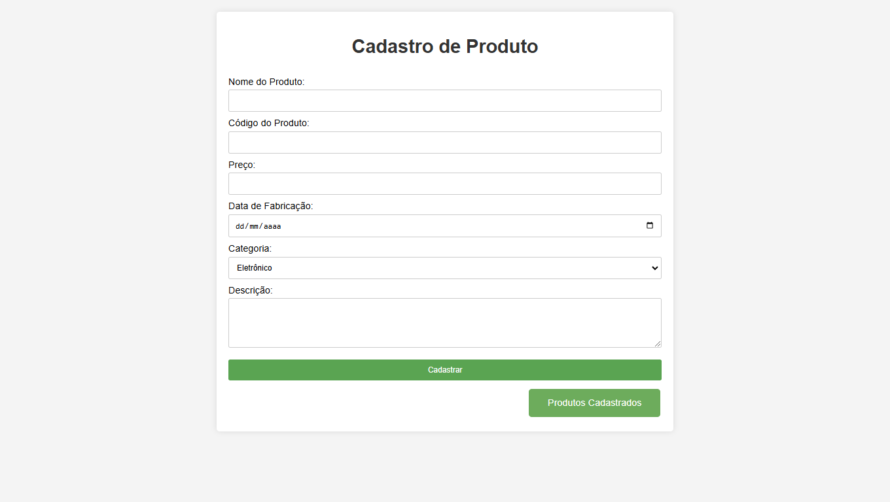
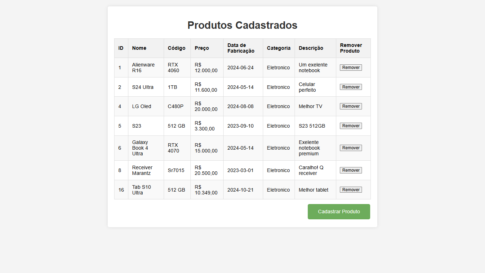
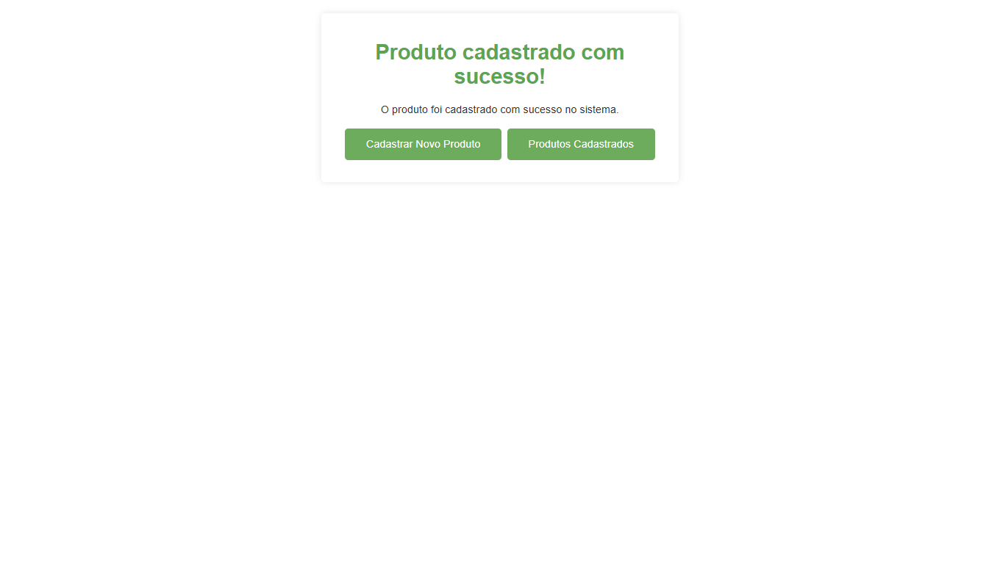

# Cadastro-de-Produtos 
## Objetivo
Este projeto foi desenvolvido com o objetivo de estudar e aplicar conhecimentos em PHP, MySQL, HTML, e CSS.
## Funcionalidades
### Cadastro de produtos

### Produtos Cadastrados

### Sucesso

## Tecnologias Utilizadas
* PHP: Linguagem principal usada para a lógica de backend.
* MySQL: Banco de dados relacional para armazenar as informações.
* HTML/CSS: Para criar a estrutura e o estilo da interface do usuário.